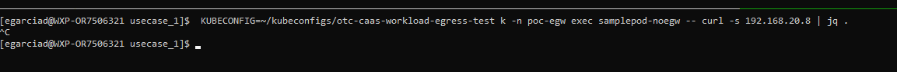

# USE CASE 1
Caso de uso empleando un egw con pata en la red 192.168.20.0/24 utilizando 3 ips de la misma como vip de salida. En este caso de uso se elige una vip para el egress gw en la misma red en la que se encuentra el echo-server.

Los pods funcionan asi
EGW: VIP 192.168.200.201
Echo server en 192.168.20.8

- samplepod-using-egw. Cuando se hace curl la ip que se envia como src es la vip del EGW

- samplepod-noegw. Cuando se hace curl al echo server la ip es la del nodo por el que sale en la red 192.168.20.0/24


En principio egress se permite desde ambos pods, sin embargo vamos a introducir una network policy que restrinja dicho tráfico en el caso de los pods que no salen por el egw

Usamos kyverno para definir esa networkpolicy.
Tras aplicar este manifest:
```
apiVersion: networking.k8s.io/v1
kind: NetworkPolicy
metadata:
  name: restrict-generic-egress
  namespace: poc-egw
spec:
  podSelector:
    matchExpressions:
      - key: egw
        operator: NotIn
        values:
          - poc-uc1
  policyTypes:
    - Egress
  egress:
    # No egress rules specified means no traffic is allowed.
```
se ve que el tráfico ya no sale si se origina en un pod sin la correspodiente etiqueta (en este caso poc-uc1)

Sin embargo, desde el pod que sí la tiene sigue funcionando el egress:


# Debug
Ejecutar el siguiente comando para obtener un pod efimero con aplicaciones para hacer troubleshooting de red. Si se ejecuta contra un pod con host-network se accedera a la red del host:
<br/>
```KUBECONFIG=~/kubeconfigs/otc-caas-workload-egress-test k -n poc-egw debug -it egressgateway-agent-n5djq --image=nicolaka/netshoot --profile=netadmin``` <br/>
La imagen `nicolaka\netshoot` esta bien; sin embargo, no incorpora iptables-legacy, sino el iptables basado en netfilter y puede no servir a nuestro propósito de inspeccionar las reglas de fw. En cambio la siguiente image: <br/>
```KUBECONFIG=~/kubeconfigs/otc-caas-workload-egress-test k -n poc-egw debug -it egressgateway-agent-n5djq --image=dougbtv/centos-network --profile=netadmin ```
<br/>sí contiene iptables tradicional.